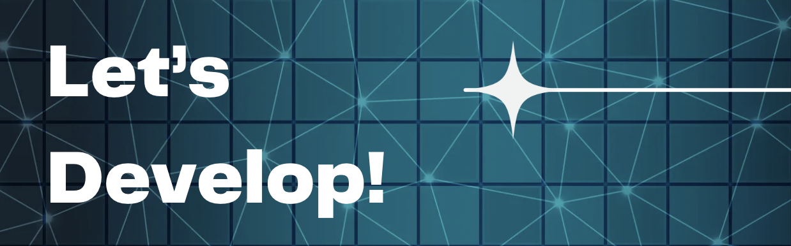

  

## About Me

👋 **Hello! I’m Anjali Tiwari**  
🎓 Currently pursuing B.Tech in Computer Science & Engineering @NIT Raipur  
💡 A curious mind with a passion for learning and growth.

---

### 🔭 What I’m Doing  
- Exploring technologies and upskilling myself.
- Building projects to deepen my learnings.

### ⚡ Fun Fact
☕ Powered by coffee and determination  

## Tech Stack 💻 :
 

 
 
 
 
 
 
 
 
 

## Tools 🛠️ :
 
 
 

---

### 🤝 Let’s Connect  
I love collaborating on open-source projects and exchanging ideas. Feel free to reach out! 💬

## Socials 🌐 :
 
 

---

